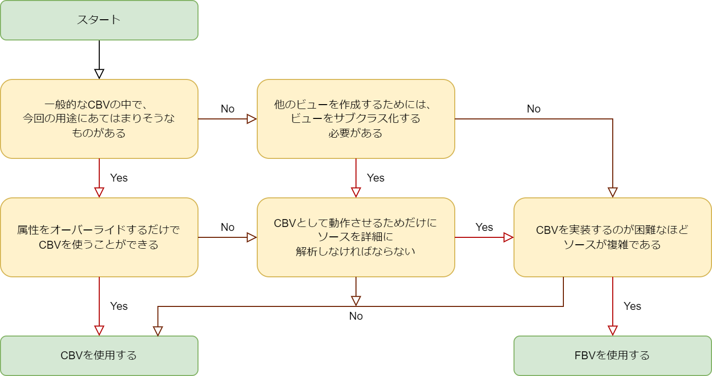

# Two Scoops of Django 3.x

## 8. 関数ベース、あるいはクラスベースのビュー
- **関数ベースのビュー**(FBV)と**クラスベースのビュー**(CBV)は、どちらもDjangoの中核をなすものである。
- 両タイプのビューの使い方を理解することを推奨する。

### 8.1 FBVとCBVをどう使うか
- ビューを実装するときは、FBVとCBVのどちらで実装するのが理にかなっているのか考えること。
- どちらの方法を選択すべきかわからない場合のために、以下にフローチャートを示す。

<br>

<br>

- このフローチャートは、FBVよりもCBVを使用することを推奨している。
  - ほとんどのビューにはCBVを使用し、FBVはカスタムエラービューやCBVでは実装が困難な複雑なものだけを実装するために使用する。
- [TIP] 基本的にFBVを使用する場合もある
  - ほとんどのビューにFBVを使用し、サブクラス化が必要なビューにのみCBVを使用するという方法を好む開発者もいる。

### 8.2 ビューのロジックをURLConfsに入れない
- リクエストは `URLConfs` を経由して、通常`urls.py`という名前のモジュール内のビューに送られる。
- URLルートの定義はシンプルでなければならないということを念頭に置くこと。
- viewsモジュールにはビューに関するロジックのみが含まれ、URLモジュールにはURLに関するロジックのみが含まれるべき。
- 以下、URLにビューロジックが含まれる悪い例。

```python
# Don't do this!
from django.urls import path
from django.views.generic import DetailView

from tastings.models import Tasting

urlpatterns = [
    path('<int:pk>',
        DetailView.as_view(
            model=Tasting,
            template_name='tastings/detail.html'),
        name='detail'),
    path('<int:pk>/results/',
        DetailView.as_view(
            model=Tasting,
            template_name='tastings/results.html'),
        name='results'),
]
```

- このコードは一見すると問題ないように見えるが、筆者は以下の理由でDjangoの設計理念に反していると考える。
  - ビュー、URL、モデルが密結合になっており、ビュー定義の再利用ができなくなっている。
  - CBV間で同じ (または類似した) 引数が繰り返し使われており、DRY原則に違反している。
  - URLの柔軟性が破壊されている。CBVの最大の利点であるクラスの継承は、この例では不可能になっている。
  - 他にもたくさんの問題がある。
    - 認証を追加しなければならない場合どうするか？
    - 承認については？それぞれのURLConfsをデコレータでラップする？
    - 訳者註: 認証 (Authentication)は「サービスへアクセスしてきたユーザが本人かどうか検証すること」、承認 (Authorization) は「認証済みユーザーが指定したリソースへアクセスできるかどうかを制御すること」。

- 次のセクションでは、良い例を紹介する。

### 8.3 URLConfsを疎結合にする
- ここでは、先述した問題を回避するURLConfsの実装方法を紹介する。
- まず、viewsを作成する。

```python
from django.urls import reverse
from django.views.generic import ListView, DetailView, UpdateView

from .models import Tasting

class TasteListView(ListView):
    model = Tasting

class TasteDetailView(DetailView):
    model = Tasting

class TasteResultsView(TasteDetailView):
    template_name = 'tastings/results.html'

class TasteUpdateView(UpdateView):
    model = Tasting

    def get_success_url(self):
        return reverse('tastings:detail',
            kwargs={'pk': self.object.pk})
```

- 次にURLを定義する。

```python
from django.urls import path

from . import views

urlpatterns = [
    path(
        route='',
        view=views.TasteListView.as_view(),
        name='list'
    ),
    path(
        route='<int:pk>/',
        view=views.TasteDetailView.as_view(),
        name='detail'
    ),
    path(
        route='<int:pk>/results/',
        view=views.TasteResultsView.as_view(),
        name='results'
    ),
    path(
        route='<int:pk>/update/',
        view=views.TasteUpdateView.as_view(),
        name='update'
    )
]
```

- この方法を採用する理由は、以下のとおり。
  - **DRY**
    - 引数や属性がビュー間で繰り返されていない。
  - **疎結合**
    - ビューはビューで、URLConfsはURLConfsであるべき。
    - URLConfsからモデルとテンプレートの名前がなくなっている。
    - これにより複数のURLConfsからビューを呼び出すことが可能になる。
  - **一つのことをうまくやる**
    - URLConfsはURLルーティングという単一の責任にフォーカスしている。
    - ビューのロジックを追跡する時に、ビューを読むだけで済む。(ビューとURLConfsの両方を読む必要がない)
  - **CBVであることの恩恵**
    - ビューモジュールとして正式に定義されているので、他のクラスを継承することができる。
    - つまり、認証や承認などのビジネス要件に対応しやすい。
  - **無限の柔軟性**
    - ビューモジュールとして正式に定義されているので、独自のカスタムロジックを実装することができる。

#### 8.3.1 CBVを使用していない場合は？
- 同じルールが適用される。(URLとビューは分割する。)
- 例えば、Python モジュールの \_\_file\_\_ 属性を使ったり、ディレクトリ移動や正規表現を組み合わせてURLConfsを自動的に作成したりといった、URLConfsに対する様々なハッキング的技法を駆使したFBV主体のプロジェクトも過去に存在したが、著者の経験上、それらのデバッグは悪夢のようなものだった。
- FBVであっても同様に、URLConfsにはロジックを持ち込まないこと。

### 8.4 URL 名前空間の使用
- URL名前空間とは、アプリレベルおよびインスタンスレベルの名前空間の識別子を提供するものである。
- URL名をtastings_detailのように書く代わりに、tastings:detailのように書くことで、URL名前空間の恩恵を受けられる。
- 先程登場したサンプルコードを再度取り上げ、名前空間URLConfの実装例を紹介する。
- ルートURLConfに次のように追加する。

```python
urlpatterns += [
    path('tastings/', include('tastings.urls', namespace='tastings')),
]
```

- ビューは以下のようになる。

```python
# tastings/views.py snippet
class TasteUpdateView(UpdateView):
    model = Tasting
    
    def get_success_url(self):
        return reverse('tastings:detail',
            kwargs={'pk': self.object.pk})
```

- HTMLテンプレートは以下のようになる。

```django


Tastings


<ul>
  
    <li>
      <a href="">{{ taste.title }}
      </a>
      <small>
        (<a href="">update</a>)
      </small>
    </li>
  
</ul>

```

- 次に、URL名前空間の有用性について説明する。

#### 8.4.1 より短く、より直感的で、繰り返しのないURL名を作ることができる
- 上記例では、"tastings_detail "や "tastings_results "のような、モデルやアプリの名前をコピーしたURL名がなくなり、代わりに「detail」や「results」といったシンプルで直感的な名前に置き換わっている。
- これにより、アプリの可読性が大幅に向上する。

#### 8.4.2 サードパーティライブラリとの相互運用性の向上 
- \<myapp>\_detail のような URL 名を書くときの問題の1つは、アプリ名が衝突してしまうことである。
- URL名前空間を使えば、この問題は簡単に解決できる。
- 既存アプリに新規アプリを追加する必要がある場合でも、URL名前空間を使えばルートURLConfにそれらを統合することができる。
- 以下はその例である。

```python
# urls.py at root of project
urlpatterns += [
    path('contact/', include('contactmonger.urls',
                        namespace='contactmonger')),
    path('report-problem/', include('contactapp.urls',
                        namespace='contactapp')),
]
```

- そして、次のようにしてそれらをテンプレートに反映させる。

```django

Contact

<p>
  <a href="">Contact Us</a>
</p>
<p>
  <a href="">Report a Problem</a>
</p>

```

#### 8.4.3 検索、改善、リファクタリングの容易化
- DjangoのようなPEP 8に適したフレームワークなどでは名前にアンダースコアが頻繁に使用されていることを考えると、`tastings_detail` のようなコードや名前を検索するのは難しい。
  - 検索結果が出たとき、それはビューの名前なのか、URLの名前なのか、それとも他の何かなのかわからない。
- 一方で、`tastings:detail`と検索すると、直感的な検索結果を得られる。
- これにより、アプリケーションやプロジェクトの改善やリファクタリングが容易になり、新しいサードパーティのライブラリとの連携も可能になる。

#### 8.4.4 アプリやテンプレートにまつわる裏技的な技法がさらに可能になる
- ここではどんな方法も説明しない。なぜなら、そのようなトリックはプロジェクトが複雑になるだけで実用的な利益は得られないため、ほとんどは正当化されないからである。
- しかし、特筆すべき使用例がいくつかある。
  - デバッグレベルのイントロスペクションを行うdjango-debug-toolbarのような開発ツール。
  - エンドユーザがモジュールを追加して、自分のアカウントの動作を変更したり、変えたりできるようなプロジェクト。
- このような限られた場合にのみ、独創的なURL名前空間の技法が正当化されることがあるかもしれない。ただそうだとしても、まずは最もシンプルな方法から試すことを推奨する。
- 訳者註: "Reverse Tricks" をどう訳すか悩んだ (結局「裏技的な技法」とした)。
  - リバースエンジニアリングの「リバース」なのか？どちらにせよ、正攻法ではない、トリッキーな、副作用の大きい手段という意味は文脈から明らかなので、大きくは外していないと思う。

### 8.5 ビジネスロジックをビューに入れないようにする
- PDFを生成したり、REST APIを追加したり、他のフォーマットを提供したりするなどのビジネス要件の変化の際、ビューに多くのロジックが配置されているとそれらが困難になる。
- そこで、モデルメソッドやマネージャーメソッド、一般的なユーティリティーのヘルパー関数などの手段が必要になる。
- ビジネスロジックを再利用しやすいコンポーネントに配置し、ビューから呼び出すことができれば、プロジェクトのコンポーネントを拡張してより多くのことを行うことが容易になる。
- 経験則から、ビジネスロジックが複数のビューの間で重複しる場合はコードをビューの外に移すべきだと考えている。

### 8.6 Djangoのビューは関数である
- 結局のところ全てのDjangoのビューは、HTTPリクエストを受け取り、それを HTTPレスポンスに変える関数である。
  - 基本的な数学関数と同様。

```python
# DjangoのFBV
HttpResponse = view(HttpRequest)

# 数学の基礎的な関数
y = f(x)

# DjangoのCBV
HttpResponse = View.as_view()(HttpRequest)
```

- この概念は、FBV、CBV問わず、 Djangoのビューでできる様々なことの基礎となる。

- [TIP] クラスベースのビューも実際には関数として呼び出される
  - CBVはFBVとは大きく異なるように見えるが、URLConfsで呼び出される`View.as_view()`メソッドは、実際には呼び出し可能なビューのインスタンスを返している。
  - 言い換えれば、関数ベースのビューと全く同じ方法でリクエスト／レスポンスのサイクルを処理するコールバック関数である。

#### 8.6.1 最もシンプルなビュー
- 上記を念頭に置いて、Djangoで作れる最もシンプルなビューは以下である。

```python
from django.http import HttpResponse
from django.views.generic import View

# The simplest FBV
def simplest_view(request):
    # Business logic goes here
    return HttpResponse('FBV')

# The simplest CBV
class SimplestView(View):
    def get(self, request, *args, **kwargs):
        # Business logic goes here
        return HttpResponse('CBV')
```

- 最もシンプルなビューを知っていることの利点は以下である。
  - 小さなことをする一回限りのビューが必要になることがある。
  - 最も単純なビューを理解することは、実際の処理がどうなっているかをより良く理解することになる。
  - FBVはHTTPメソッドに依存しないが、CBVは特定のHTTPメソッドの宣言を必要とすることがわかる。

### 8.7 ビューのコンテキストに `locals()` を使わない
- 手軽なショートカットのように見えるが、任意の callable関数から`locals()`を返すのは、アンチパターンである。
- その理由を例を挙げて説明する。

```python
# Don't do this!
def ice_cream_store_display(request, store_id):
    store = get_object_or_404(Store, id=store_id)
    date = timezone.now()
    return render(request, 'melted_ice_cream_report.html',
        locals())
```

- 一見問題ないように見えるが、ビューの実装が暗黙的になっており、何を返すのかがわからない。それにより保守性が損なわれている。
  - 具体的には、ビューが何を返すのかがわからない。
- ビューが返す内容を変更しても、それがすぐにはわからないため問題になる。

```python
# Don't do this!
def ice_cream_store_display(request, store_id):
store = get_object_or_404(Store, id=store_id)
date = timezone.now()
return render(request, 'melted_ice_cream_report.html',
,→ locals())
```

- 以下は明示的なビューの例。

```python
def ice_cream_store_display(request, store_id):
    return render(
        request,
        'melted_ice_cream_report.html',
        {
            'store': get_object_or_404(Store, id=store_id),
            'now': timezone.now()
        }
    )
```

### 8.8 まとめ
- 本章では、まずFBVとCBVのどちらを使うべきかを議論した。
- ビューに関するロジックをURLConfsに含めてはならない。
  - ビューのコードはアプリのviews.pyに、URLConfのコードはアプリのurls.pyモジュールに入れるべきである。
  - ビューとURLを分離することで、(CBVの場合は) 継承が可能になり、コードの再利用が容易になり、設計の柔軟性が高まる。