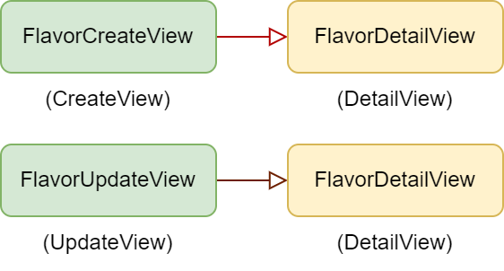
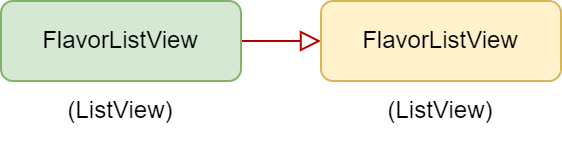

# Two Scoops of Django 3.x

## 10. CBVのベストプラクティス
- Django はクラスベースビュー (CBV) を書くための標準的な方法を提供している。
- 実際、これまでの章で述べたように、Djangoのビューはリクエストを受け取りレスポンスを返すcallable関数に過ぎない。
  - 関数ベースのビュー(FBV)では、ビュー関数がそれに当たる。
- CBVの場合は、ビュークラスが `as_view()` クラスメソッドを提供して、そのcallable関数を返す。
  - この仕組みは `django.views.generic.View`で実装されており、すべてのCBVはそのクラスを継承しなければならない。
- Djangoは、一連の汎用クラスベースビュー (GCBV) も提供している。
  - 多くのWebプロジェクトで見られる一般的なパターンを実装している。
- [PACKAGE TIP] GCBVの不足点を補う方法
  - デフォルトのDjangoは、GCBVのためのミックスインを提供していない。
  - `django-braces`ライブラリはこれらの問題のほとんどを解決する。
  - このライブラリは明確にコード化されたミックスイン群を提供しており、DjangoのGCBVをより簡単かつ高速に実装できる。

### 10.1 CBV を使うときのガイドライン
- ビューのコードは少ない方が良い。
- ビューの中でコードを繰り返してはいけない
- ビューには表示に関わるロジックのみ書く。
- ビジネスロジックは可能な限りモデルに、必要に応じてフォームに置くようにすること。
- ビューはシンプルにする。
- ミックスインはシンプルにする。
- [TIP] [Classy Class-Based Views.](ccbv.co.uk) をよく理解する。
  - このサイトは、全てのCBVが定義したり継承したりする属性やメソッ ドを、ビューごとに1 つの包括的なページにまとめている。
  - ほとんどのDjango開発者は、CBVのチュートリアルを終えると、公式ドキュメントよりもこのサイトに頼るようになる。

### 10.2 CBVでミックスインを使う
- プログラミングにおいてミックスインとは、継承すべき機能を提供するが、単体ではインスタンス化を意図しないクラスのことである。
- 多重継承が可能なプログラミング言語では、ミックスインを使用してクラスに拡張機能や動作を追加することができる。
- ミックスインの力を利用して、Djangoアプリ用に独自のビュークラスを構成することができます。
- ミックスインを使って独自のビュークラスを構成する際には、Kenneth Love氏が提供した継承のルールを推奨する。
- このルールはPythonのメソッド解決順序 (基本的に左から右へと進む) を考慮したものである。
  1. Djangoの提供している基底ビュークラスは、常に右側に配置する。
  2. ミックスインは基底ビュークラスの左に配置する。
  3. ミックスインは他のクラスを継承してはいけない。
    - 継承の連鎖はできるだけシンプルにする。 

- このルールに基づいた実装例

```python
from django.views.generic import TemplateView

class FreshFruitMixin:

    def get_context_data(self, **kwargs):
        context = super().get_context_data(**kwargs)
        context["has_fresh_fruit"] = True
        return context
        
class FruityFlavorView(FreshFruitMixin, TemplateView):
    template_name = "fruity_flavor.html"
```

- 上記例では、`FruityFlavorView`クラスは、`FreshFruitMixin`と`TemplateView`の両方を継承している。
- `TemplateView` は Djangoが提供する基底ビュークラスなので、一番右に配置し (ルール1)、その左に `FreshFruitMixin` を配置します (ルール2)。
- こうすることで、メソッドやプロパティが正しく実行される。

### 10.3 どのタスクにどの Django GCBV を使うべきか？
- GCBVの強力さは、一方でシンプルさを犠牲にする。GCBVには複雑な継承構造があり、インポートされると最大8個のスーパークラスがついてくる。
- どのビューを使うか、どのメソッドをカスタマイズするかを正確に判断するのは、非常に難しいことである。
- この問題を軽減するために、ここでは各CBVの名前と目的を一覧化した表を用意した。
  - 掲載されている全てのビューの前には`django.views.generic`が付いているものとする。

|名称|目的|本書での例|
|:--|:--|:--|
|View|何にでも使え、基底ベースとしても使える便利なビュー。|10.6章参照|
|RedirectView|ユーザを別のURLにリダイレクトする|'log-in/'を訪れたユーザを '/login/'に送る。|
|TemplateView|DjangoのHTMLテンプレートを表示する|'/about/'ページ|
|ListView|リストオブジェクト|アイスクリームのフレーバーのリスト。|
|DetailView|オブジェクトの表示|アイスクリームのフレーバーの詳細表示。|
|FormView|フォームの送信|サイトのお問い合わせやメールフォーム。|
|CreateView|オブジェクトの作成|アイスクリームの新しいフレーバーを作成する。|
|UpdateView|オブジェクトの更新|既存のアイスクリームのフレーバーを更新する。|
|DeleteView|オブジェクトの削除|バニラステーキのような不味いアイスクリームを削除する。|
|Generic date views|ある期間に発生したオブジェクトを表示する。|ブログなどでよく使用される。'Two Scoops'では、データベースにフレーバーの追加履歴を公開することができる。|

- [TIP] DjangoのCBV/GCBVの使い方に関する3つの流派
  - CBVやGCBVの使い方には、大きく分けて3つの考え方がある。
- **流派1「ジェネリックビューを使いまくる」**
  - Djangoが作業量を減らすための機能を提供しているのだからふんだんに使えばいい、という考えに基づいた流派である。
  - 著者の考えはこれに近く、基本的にはこれで多くのプロジェクトを迅速に構築し、維持することができている。
- **流派2「`django.views.generic.View`だけ使う」**
  - DjangoのCBVはそれだけで十分な機能を持つのでGCBVは使わなくとも問題ない、という考えに基づいた流派である。
  - 「ジェネリックビューを使いまくる」派のようなリソースを潤沢に使用するアプローチが取れない場合に非常に有効なアプローチである。
  - この章では、その使用例をいくつか紹介する。
- **流派3「サブクラス化しない限りは使わない」**
  - 基本的には読みやすく理解しやすいFBVを使い、必要なとき (継承するとき) だけCBVを使う流派。
  - 複数のビューの間でかなりの量のコードを再利用する必要がある場所でCBVを使用する。

### 10.4 DjangoのCBVに関する一般的なヒント
- このセクションでは、DjangoのCBVやGCBVで使える、実装に役立つヒントを扱う。
- これらは、ビューやテンプレート、それらのテストを書くのに役立つ。
- DjangoのCBVは、オブジェクト指向プログラミングの技術に依存している。

#### 10.4.1 CBV/GCBVのアクセスを認証済みユーザに限定する
- [Django CBVのドキュメント](docs.djangoproject.com/ja/3.2/topics/class-based-views/intro/#decorating-class-based-views)では、`django.contrib.auth.decorators.login_required` デコレータをCBVと一緒に使った実例を紹介しているが、この例はurls.pyにロジックを入れないようにするというルールに違反している。
- Djangoにはすぐにアタッチできる`LoginRequiredMixin`が用意されているので、そちらを使うのがよい。
- 例えば、次のように実装することができる。

```python
# flavors/views.py
from django.contrib.auth.mixins import LoginRequiredMixin
from django.views.generic import DetailView

from .models import Flavor

class FlavorDetailView(LoginRequiredMixin, DetailView):
    model = Flavor
```

- [TIP] ミックスインの順序に関するルールを忘れないこと
  - 次のことを覚えておくこと。
    - `LoginRequiredMixin` は常に左端に置く必要がある。
    - 基底ビュークラスは常に右端に配置する必要がある。
      - 順番を入れ替えると、壊れたり予測できない結果になったりする。

- [警告] `LoginRequiredMixin`使用時の`dispatch()`オーバーライド
  - `LoginRequiredMixin`を使用して`dispatch`メソッドをオーバーライドする場合は、最初に`super().dispatch(request, \*args, \*\*kwargs)`を呼び出すことに注意する。
  - `super()`呼び出しの前のコードは、ユーザーが認証されていなくても実行される。

#### 10.4.2 有効なフォームを持つビューでのカスタムアクションの実行
- 有効なフォーム (valid form) を持つビュー上でカスタムアクションを実行する必要がある場合、`form_valid()`メソッドは、GCBVワークフローがリクエストを送信する場所である。
- すでに検証されたフォームデータに対してカスタムロジックを実行するには、`form_valid()`にロジックを追加するだけでよい。
- `form_valid()` の戻り値は `django.http.HttpResponseRedirect` でなければならない。

```python
from django.contrib.auth.mixins import LoginRequiredMixin
from django.views.generic import CreateView

from .models import Flavor

class FlavorCreateView(LoginRequiredMixin, CreateView):
    model = Flavor
    fields = ['title', 'slug', 'scoops_remaining']

    def form_valid(self, form):
        # Do custom logic here
        return super().form_valid(form)
```

#### 10.4.3 無効なフォームを持つビューでのカスタムアクションの実行
- 無効なフォーム (invalid form) を持つビューに対してカスタムアクションを実行する必要がある場合、GCBVでは `form_invalid()` メソッドでリクエストを送信する。
- このメソッドは`django.http.HttpResponse`を返す必要がある。

```python
from django.contrib.auth.mixins import LoginRequiredMixin
from django.views.generic import CreateView

from .models import Flavor

class FlavorCreateView(LoginRequiredMixin, CreateView):
    model = Flavor

    def form_invalid(self, form):
        # Do custom logic here
        return super().form_invalid(form)
```

- form_valid()にロジックを追加できるように、form_invalid()にもロジックを追加できる。

#### 10.4.4 ビューオブジェクトの使用
- コンテンツのレンダリングにCBVを使用している場合は、 ビューオブジェクト自体にプロパティやメソッドを持たせることを検討すること。
- これらは、テンプレートから呼び出すこともできる。

- 例えば、以下のようになる。

```python
from django.contrib.auth.mixins import LoginRequiredMixin
from django.utils.functional import cached_property
from django.views.generic import UpdateView, TemplateView

from .models import Flavor
from .tasks import update_user_who_favorited

class FavoriteMixin:

    @cached_property
    def likes_and_favorites(self):
        """Returns a dictionary of likes and favorites"""
        likes = self.object.likes()
        favorites = self.object.favorites()
        return {
            "likes": likes,
            "favorites": favorites,
            "favorites_count": favorites.count(),
        }

class FlavorUpdateView(LoginRequiredMixin, FavoriteMixin, UpdateView):
    model = Flavor
    fields = ['title', 'slug', 'scoops_remaining']

    def form_valid(self, form):
        update_user_who_favorited(
        instance=self.object,
        favorites=self.likes_and_favorites['favorites']
    )
    return super().form_valid(form)

class FlavorDetailView(LoginRequiredMixin, FavoriteMixin, TemplateView):
    model = Flavor
```

- このサンプルの良いところは、様々なアプリのテンプレートがこのプロパティにアクセスできるようになったことである。

```django
{# flavors/base.html #}



<ul>
  <li>Likes: {{ view.likes_and_favorites.likes }}</li>
  <li>Favorites: {{ view.likes_and_favorites.favorites_count }}</li>
</ul>

```

### 10.5 GCBVとFormをどう連携させるか
- GCBVを使う上で混乱のもととなるのは、Djangoフォームとの連携である。
- アイスクリームのフレーバー追跡アプリを例にして、Formと関連するビューがどのように連携するかを示す。
- まず、この例で使うflavorモデルを定義する。

```python
# flavors/models.py
from django.db import models
from django.urls import reverse

class Flavor(models.Model):
    class Scoops(models.IntegerChoices)
        SCOOPS_0 = 0
        SCOOPS_1 = 1

    title = models.CharField(max_length=255)
    slug = models.SlugField(unique=True)
    scoops_remaining = models.IntegerField(choices=Scoops.choices,
        default=Scoops.SCOOPS_0)

    def get_absolute_url(self):
        return reverse("flavors:detail", kwargs={"slug": self.slug})
```

#### 10.5.1 View + ModelForm の例
- これは最も単純で最も一般的なDjangoのフォームのシナリオです。
- 通常、モデルを作成するときには、そのモデルに対応する新しいレコードの追加や、既存のレコードの更新をできるようにしたい。
- この例では、フレーバーのレコードを作成したり、更新したり、表示したりする一連のビューの作り方を紹介する。
- また、変更内容の確認を行う方法についても説明する。
- ここでは、次のようなビューを用意している。
  1. `FlavorCreateView`は、新しいフレーバーを追加するためのフォームに対応する。
  2. `FlavorUpdateView`は、既存のフレーバーを編集するためのフォームに対応する。
  3. `FlavorDetailView`は、フレーバー作成と更新の両方の確認ページに対応する。

<br>

- 

<br>

- Djangoの命名規則に忠実に従っていることに注意すること。
- 以下を明示的に表す命名である。
  - `FlavorCreateView`はDjangoの`CreateView`のサブクラスである
  - `FlavorUpdateView`はDjangoの`UpdateView`のサブクラスである
  - `FlavorDetailView`はDjangoの`DetailView`のサブクラスである
- ほとんどDjangoが提供するものを使うだけなので、これらのビューは容易に実装できる。

```python
# flavors/views.py
from django.contrib.auth.mixins import LoginRequiredMixin
from django.views.generic import CreateView, DetailView, UpdateView

from .models import Flavor

class FlavorCreateView(LoginRequiredMixin, CreateView):
    model = Flavor
    fields = ['title', 'slug', 'scoops_remaining']

class FlavorUpdateView(LoginRequiredMixin, UpdateView):
    model = Flavor
    fields = ['title', 'slug', 'scoops_remaining']

class FlavorDetailView(DetailView):
    model = Flavor
```

- これらのビューをurls.pyモジュールに配線し、必要なテンプレートを作成すると、下記の問題が発生する。

> FlavorDetailViewは確認ページではありません。

- 既存のビューとテンプレートに少し手を加え、この問題を修正する。
- まずは`django.contrib.messages` を使って、`FlavorDetailView` を訪れたユーザに、フレーバーを追加または更新したことを通知する。
  - そのために、`FlavorCreateView.form_valid()` と `FlavorUpdateView.form_valid()` をオーバーライドする。
- `FlavorActionMixin`を使えば、両方のビューに対して簡単に実行できる。
- 確認ページの修正では、flavors/views.py を以下のように変更する。

```python
# flavors/views.py
from django.contrib import messages
from django.contrib.auth.mixins import LoginRequiredMixin
from django.views.generic import CreateView, DetailView, UpdateView

from .models import Flavor

class FlavorActionMixin:

    fields = ['title', 'slug', 'scoops_remaining']

    @property
    def success_msg(self):
        return NotImplemented

    def form_valid(self, form):
        messages.info(self.request, self.success_msg)
        return super().form_valid(form)

class FlavorCreateView(LoginRequiredMixin, FlavorActionMixin,
                        CreateView):
    model = Flavor
    success_msg = "Flavor created!"

class FlavorUpdateView(LoginRequiredMixin, FlavorActionMixin,
                        UpdateView):
    model = Flavor
    success_msg = "Flavor updated!"

class FlavorDetailView(DetailView):
    model = Flavor
```

- GCBV内で`form_valid()`をオーバーライドする例を紹介した。
- 複数のビューで継承するミックスインを作成し、同じような`form_valid()`を再利用するようにした。
- ここで、Djangoのメッセージフレームワークを使って、追加や編集が成功したときに、ユーザに確認メッセージを表示する。

- [TIP] `SuccessMessageMixin`
  - この節を書いた2013年以降、Djangoは同様の機能を持つ `django.contrib.messages.views.SuccessMessageMixin`を実装した。
  - [SuccessMessageMixin](https://docs.djangoproject.com/en/3.2/ref/contrib/messages/#django.contrib.messages.views.SuccessMessageMixin)

- [TIP] ミックスインは他のオブジェクトを継承してはいけない
  - `FlavorActionMixin`は、既存のミックスインやビューではなく、コード内の他のクラスを継承していない基底クラスであることに注意する。
  - ミックスインは、可能な限り継承の連鎖を浅い状態に保つこと。

- フレーバーが作成または更新されると、メッセージのリストが`FlavorDetailView`のコンテキストに渡される。
- 以下のコードをビューのテンプレートに追加してからフレーバーを作成または更新すると、これらのメッセージを見ることができる。

```django

  <ul class="messages">
    
    <li id="message_{{ forloop.counter }}"
       class="{{ message.tags }}"
        >
      {{ message }}
    </li>
    
  </ul>

```

- [TIP] メッセージテンプレートのコードを再利用する
  - 上記のコードをプロジェクトのベースとなるHTMLテンプレートに入れるのが一般的です。
  - このようにすることで、プロジェクトのテンプレートでメッセージをサポートすることができます。

#### 10.5.2 View + Form の例
- 検索フォームなどを実装するケースでは、`ModelForm`よりも`Form`を使いたいことがある。この章では、シンプルなフレーバーの検索フォーム (フレーバーのデータを変更しないHTMLフォーム) を作ってみる。
- このページではフォームのアクション経由でORMがクエリを実行し、該当するレコードは検索結果ページに表示される。
  - ユーザーが「Dough」を検索した場合、「Chocolate Chip Cookie Dough」、「Fudge Brownie Dough」、「Peanut Butter Cookie Dough」など、タイトルに「Dough」という文字列を含むアイスクリームのフレーバーがリストアップされるようにしたい。
- 今回のシンプルな使用例では、1つのビューをつかって実装する。

<br>

- 

<br>

- 検索ページと検索結果の両方に`FlavorListView`を使うことにする。

- このシナリオでは、インターネットの標準的な検索ページの規則に従って、検索クエリパラメータに`q`を使用する。
- また、POSTではなくGETのリクエストを受け付ける。
  - フォームでは珍しいが、このユースケースではオブジェクトの追加、編集、削除は行わないので、POSTリクエストは必要ない。
- 検索クエリに基づいて一致する検索結果を返すために、ListViewの`get_queryset()`メソッドをオーバーライドする。
- 以下のコードを flavors/views.py に追加する。

```python
from django.views.generic import ListView

from .models import Flavor

class FlavorListView(ListView):
    model = Flavor

    def get_queryset(self):
        # Fetch the queryset from the parent get_queryset
        queryset = super().get_queryset()

        # Get the q GET parameter
        q = self.request.GET.get("q")
        if q:
            # Return a filtered queryset
            return queryset.filter(title__icontains=q)
        # Return the base queryset
        return queryset
```

- タイトルに検索文字列が含まれているフレーバーのみを返している。
- 先に述べたように、検索フォームは一般的なHTMLフォームとは異なり、HTMLフォームの中でGETリクエストを指定するという珍しいものである。これは、検索フォームがデータを変更せず、単にサーバーから情報を取得しているだけだからである。

- 検索フォームは以下のようになる。

```django
{# templates/flavors/_flavor_search.html #}

  Usage: 

<form action="" method="GET">
  <input type="text" name="q" />
  <button type="submit">search</button>
</form>
```

- [TIP] 検索フォームでのフォームターゲットの指定
  - また、検索フォームは複数のページに含まれることが多いため、フォームアクションにURLを指定するようにしている。
  - これは、検索フォームが複数のページに含まれることが多いことに着目したもので、検索フォームの前に「\_」を付け、他のテンプレートにも含まれるように作成している。
- `get_queryset()`をオーバーライドすれば、後は上記のようなシンプルなHTMLフォームを作成するだけでよい。

### 10.6 `django.views.generic.View`だけを使う場合
- プロジェクトを構築する上で、全てのビューに`django.views.generic.View`を使うのはそう極端な話ではない。
  - 例えば、[公式ドキュメントのCBVについての記事](docs.djangoproject.com/en/3.2/topics/class-based-views/intro/#using-class-based-views) を見ると、FBVに非常に近いアプローチで書かれていることがわかる。
  - FBVでifを入れ子にして異なるHTTPメソッドを表現したり、HTTPメソッドを`get_context_data()`や`form_valid()`の後ろに隠蔽するCVBを表現したりする代わりに、それらにすぐアクセスできるようになっているのである。

```python
from django.contrib.auth.mixins import LoginRequiredMixin
from django.shortcuts import get_object_or_404
from django.shortcuts import render, redirect
from django.views.generic import View

from .forms import FlavorForm
from .models import Flavor

class FlavorView(LoginRequiredMixin, View):

    def get(self, request, *args, **kwargs):
        # Handles display of the Flavor object
        flavor = get_object_or_404(Flavor, slug=kwargs['slug'])
        return render(request,
            "flavors/flavor_detail.html",
                {"flavor": flavor}
            )
            
    def post(self, request, *args, **kwargs):
        # Handles updates of the Flavor object
        flavor = get_object_or_404(Flavor, slug=kwargs['slug'])
        form = FlavorForm(request.POST, instance=flavor)
        if form.is_valid():
            form.save()
        return redirect("flavors:detail", flavor.slug)
```

- FBVでもこれは可能だが、`FlavorView`内のGET/POSTメソッド宣言は、「if request.method == ...」という条件節を繰り返すよりも読みやすいと言える。
- また、継承の連鎖が非常に浅いので、ミックスインを使っても認知過多になる心配がない。
- GCBVを多用しているプロジェクトで、JSONやPDFなどの非HTMLコンテンツを表示するために、GETメソッドを実装した`django.views.generic.View`クラスを使うことは非常に効果的である。
- FBVでCSVやExcel、PDFファイルを表示するときに使ったトリックは、 GETメソッドを使うときにも適用できる。

- 例えば、以下のようになる。

```python
from django.contrib.auth.mixins import LoginRequiredMixin
from django.http import HttpResponse
from django.shortcuts import get_object_or_404
from django.views.generic import View

from .models import Flavor
from .reports import make_flavor_pdf

class FlavorPDFView(LoginRequiredMixin, View):
    def get(self, request, *args, **kwargs):
        # Get the flavor
        flavor = get_object_or_404(Flavor, slug=kwargs['slug'])

        # create the response
        response = HttpResponse(content_type='application/pdf')

        # generate the PDF stream and attach to the response
        response = make_flavor_pdf(response, flavor)

        return response
```

- これはとても簡単な例だが、もっと多くのミックスインを活用したり、もっと多くのカスタムロジックを扱わなければならない場合、`django.views.generic.View`のシンプルさは、重量級のビューを扱うよりも簡単である。
- 要するに、FBVの利点とCBVの持つオブジェクト指向の力が組み合わさっていると言える。

### 10.7 追加情報
- docs.djangoproject.com/en/3.2/topics/class-based-views/
- docs.djangoproject.com/en/3.2/topics/class-based-views/generic-display/
- docs.djangoproject.com/en/3.2/topics/class-based-views/generic-editing/
- docs.djangoproject.com/en/3.2/topics/class-based-views/mixins/
- docs.djangoproject.com/en/3.2/ref/class-based-views/
- ccbv.co.uk
- python.org/download/releases/2.3/mro/
  - Python 2.3を対象としている、PythonがMROをどのように処理するかについて書かれたガイド。
- daniel.feldroy.com/tag/class-based-views.html
- spapas.github.io/2018/03/19/comprehensive-django-cbv-guide/
  - CBVについての詳細。
- djangodeconstructed.com/2020/04/27/roll-your-own-class-based-views-in-django/
  - CBVについての詳細。DRFでRESTful APIを作る方法を説明している。
- [PACKAGE TIP] その他の便利なCBVライブラリ
  - **django-extra-views**
    - CBVライブラリ。djadjango-bracesでカバーできないケースがある場合に。
  - **django-vanilla-views**
    - Django GCBVを、非常にシンプルで使いやすいパッケージで提供しているライブラリ。
    - django-bracesと組み合わせて使うと効果的。

### 10.8 まとめ
- この章では以下を扱った。
  - ミックスインとCBVの併用
  - DjangoのどのCBVの使い分け
  - CBVを使うときのヒント
  - CBVとフォームを連携する
  - django.views.generic.Viewの使い方
